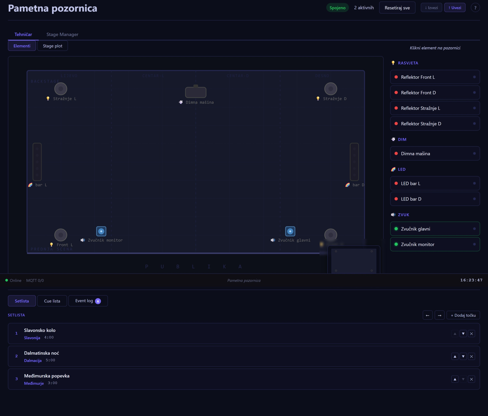
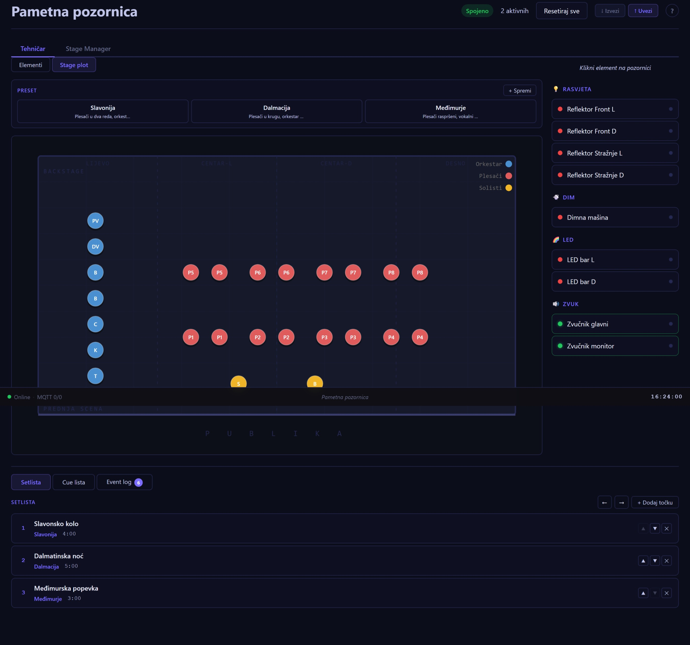
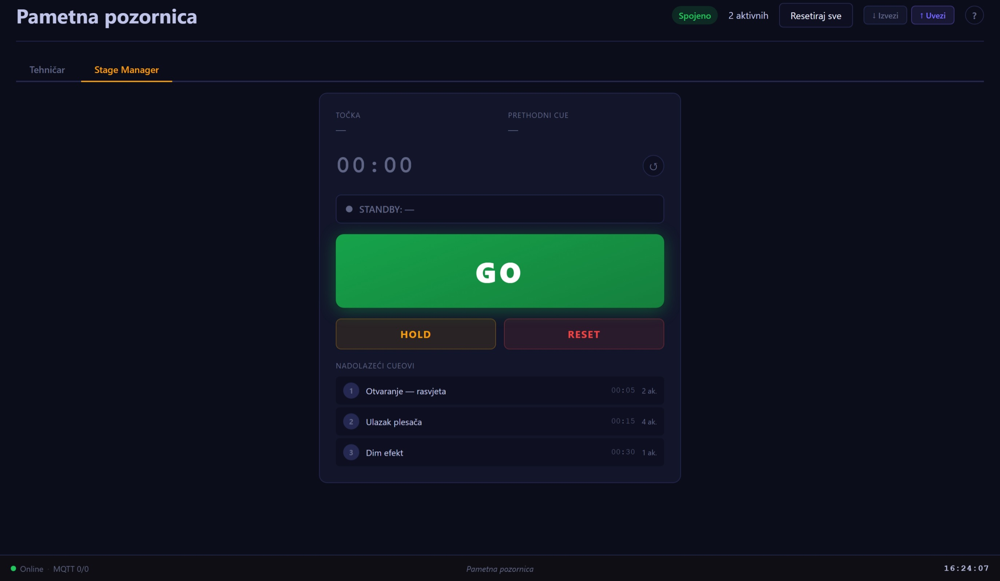

# Pametna pozornica

**Diplomski rad — Fakultet informatike u Puli (FIPU)**  
Web aplikacija za simulaciju upravljanja tehničkom produkcijom glazbenih i koreografskih izvedbi.

---

## O projektu

*Pametna pozornica* je real-time web aplikacija koja simulira IoT sustav za upravljanje scenskim elementima folklornog ansambla ili orkestra. Svaki scenski uređaj (reflektor, LED panel, dim-stroj, zvučnik) modeliran je kao autonomni virtualni IoT uređaj koji komunicira s centralnim serverom putem MQTT protokola.

**Ključne funkcionalnosti:**

- Vizualno upravljanje scenskim elementima u realnom vremenu (rasvjeta, LED, dim, zvuk)
- Stage plot s drag-and-drop rasporedom 27 izvođača
- Sustav preseta s crossfade tranzicijama između konfiguracija
- Cue lista s timeline playbackom i animiranim fade efektima
- Setlista za upravljanje redoslijedom točaka programa
- Stage Manager sučelje (GO / STANDBY / HOLD)
- Real-time event log i miniaturni prikaz pozornice
- Tipkovnički prečaci za brz rad u uvjetima izvedbe
- Export/import podataka u JSON formatu
- Integracijski testovi za verifikaciju cijelog toka

---

## Screenshots

| Upravljanje elementima | Stage plot s izvođačima | Stage Manager |
|---|---|---|
|  |  |  |

---

## Brzo pokretanje

```bash
# Server (terminal 1)
cd server && npm install && npm run dev

# Klijent (terminal 2)
cd client && npm install && npm run dev
```

Otvori [http://localhost:5173](http://localhost:5173)

Za detaljne upute vidi [INSTALL.md](INSTALL.md).

---

## Tehnologije

| Komponenta     | Tehnologija        | Verzija    |
| -------------- | ------------------ | ---------- |
| Frontend       | React              | 18.x       |
| Build tool     | Vite               | 8.x        |
| Backend        | Node.js + Express  | 18.x / 5.x |
| Real-time      | Socket.IO          | 4.x        |
| IoT simulacija | MQTT (Aedes)       | 5.x / 1.x  |
| Persistencija  | JSON datoteke (fs) | —          |

---

## Arhitektura

```
Browser (React)
    ↕  Socket.IO  ↕  REST HTTP
Node.js Server (Express)
    ├── handlers.js      → Socket.IO event handleri
    ├── CueEngine        → Timeline playback
    ├── TransitionEngine → Fade animacije (lerp)
    └── DeviceManager
            ↕ MQTT (Aedes broker :1883)
        DeviceSimulator × 9  (po jedan za svaki scenski element)
```

**Tok podataka:**

1. Klijent emitira Socket.IO event (`stage:toggleElement`)
2. `handlers.js` mutira dijeljeni `stageState`
3. `io.emit()` broadcastira promjenu svim klijentima
4. `DeviceManager` šalje MQTT komandu odgovarajućem simulatoru
5. Simulator potvrđuje izvršenje statusnom porukom

---

## Testiranje

Pokreni server, zatim:

```bash
cd server
npm test
# ili: node tests/test-flow.js
```

15-koračni integracijski test verificira: konekciju, stanje scene, toggle elementa, preset, cue add/play/remove, setlistu, Stage Manager.

---

## Socket.IO API

### Klijent → Server

| Event                                 | Payload                        | Opis                                 |
| ------------------------------------- | ------------------------------ | ------------------------------------ |
| `stage:getState`                      | —                              | Dohvati stanje scene                 |
| `stage:toggleElement`                 | `{category, id}`               | Toggle on/off                        |
| `stage:updateElement`                 | `{category, id, changes}`      | Ažuriraj element                     |
| `stage:resetAll`                      | —                              | Reset na početno stanje              |
| `stage:getPresets`                    | —                              | Dohvati presete                      |
| `stage:loadPreset`                    | `{presetId}`                   | Primijeni preset                     |
| `stage:savePreset`                    | `{name, description}`          | Spremi preset                        |
| `cue:play` / `cue:pause` / `cue:stop` | —                              | Transport                            |
| `cue:seek`                            | `{time}`                       | Skoči na sekunde                     |
| `cue:add`                             | `{name, timestamp, actions[]}` | Dodaj cue                            |
| `setlist:loadItem`                    | `{id, instant?}`               | Učitaj točku (crossfade ili instant) |
| `setlist:next` / `setlist:prev`       | `{instant?}`                   | Navigacija setlistom                 |
| `stageManager:go`                     | —                              | Okidaj standby cue                   |
| `stageManager:reset`                  | —                              | Reset SM pokazivača                  |

### Server → Klijent

| Event                  | Payload                    | Opis                |
| ---------------------- | -------------------------- | ------------------- |
| `stage:stateReset`     | `stageState`               | Cijelo stanje scene |
| `stage:elementUpdated` | `{category, element}`      | Jedan element       |
| `cue:executed`         | `{cueId}`                  | Cue izvršen         |
| `cue:transportChange`  | `{isPlaying, currentTime}` | Transport stanje    |
| `cue:finished`         | —                          | Lista završena      |
| `setlist:activeItem`   | `itemId`                   | Aktivna točka       |
| `stageManager:state`   | `{standbyId, lastFiredId}` | SM stanje           |
| `mqtt:heartbeat`       | `{deviceId, timestamp}`    | IoT heartbeat (~5s) |
| `transition:start`     | `{id, durationMs}`         | Fade počeo          |
| `transition:progress`  | `{id, progress}`           | Fade napredak 0–1   |
| `transition:complete`  | `{id}`                     | Fade završen        |

---

## Tipkovnički prečaci

| Tipka           | Akcija                               |
| --------------- | ------------------------------------ |
| `Space`         | Play / Pauza                         |
| `Enter`         | GO (Stage Manager)                   |
| `Escape`        | Odznači / zatvori                    |
| `1` / `2`       | Tab Elementi / Stage plot            |
| `3` / `4` / `5` | Tab Setlista / Cue lista / Event log |
| `?`             | Pomoć (lista prečaca)                |

---

## Struktura projekta

```
smart-stage/
├── client/              # React frontend (Vite)
│   └── src/
│       ├── hooks/       # useSocket, useStage, useEventLog
│       └── components/  # Stage, ControlPanel, CueList, Setlist...
├── server/              # Node.js backend
│   └── src/
│       ├── data/        # stageElements, presets, cueList, setlist
│       ├── engine/      # CueEngine, TransitionEngine
│       ├── mqtt/        # broker, deviceManager, deviceSimulator
│       ├── socket/      # handlers.js
│       ├── tests/       # test-flow.js
│       └── utils/       # logger, storage
├── docs/                # Diplomski rad
│   ├── diplomski-rad.md   # Izvorni tekst
│   ├── diplomski-rad.docx # Word dokument
│   ├── generate-docx.js   # Generator Word dokumenta
│   └── prezentacija-biljeske.md
├── INSTALL.md           # Upute za instalaciju
└── README.md
```

---

## Poznate limitacije

- Nema autentifikacije — svi klijenti imaju iste ovlasti
- Crossfade animira samo reflektore (ne LED, dim, zvuk)
- MQTT simulacija — nije testirano s pravim hardverom
- Nije implementiran mehanizam backup-a JSON datoteka

---

## Autor

**Gabriel Beronja**  
Diplomski rad, Fakultet informatike u Puli (FIPU), 2026.  
Mentor: doc. dr. sc. Ivan Lorencin
